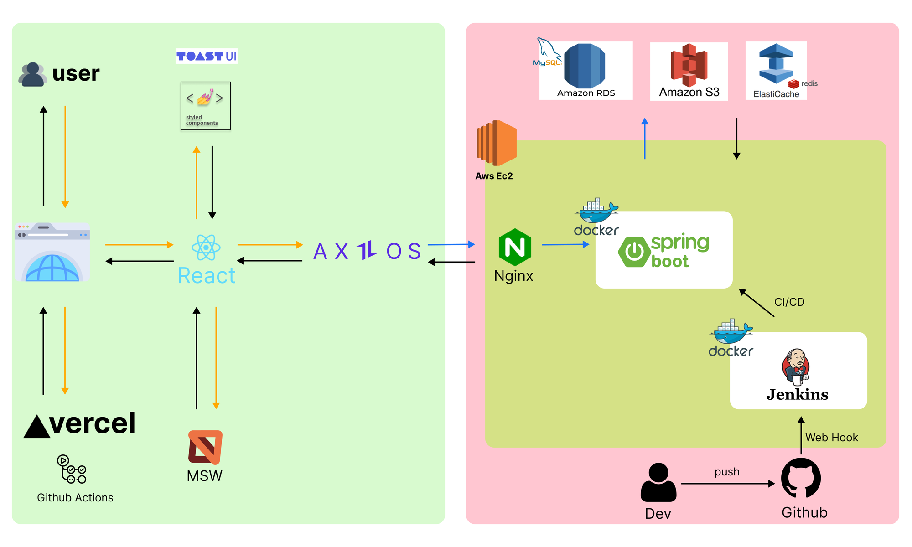
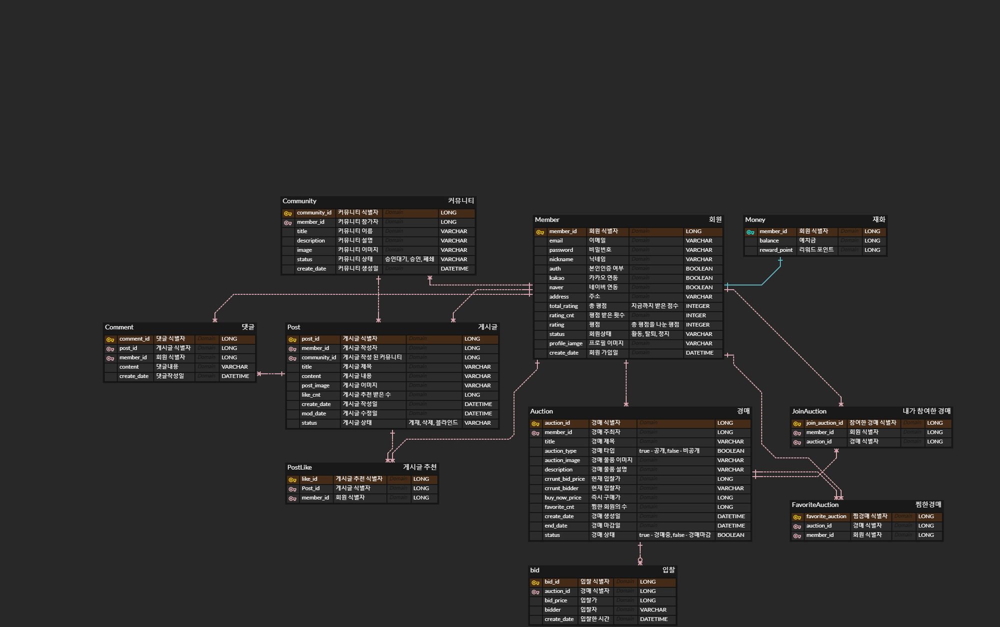

### **Fan-Tion: Fandom Auction Platform**

## 📌 프로젝트 소개

Fan-Tion은 팬덤 커뮤니티와 굿즈 거래를 한 곳에서 해결할 수 있는 통합 플랫폼입니다.  
팬들이 좋아하는 문화와 관련된 굿즈를 더 쉽게 사고 팔 수 있도록 하며, 불명확한 굿즈 시세를 실시간으로 확인할 수 있게 합니다.  
또한, 경매 시스템을 통해 합리적인 가격에 굿즈를 거래할 수 있어 팬들 간의 신뢰성을 높이고, 보다 안전한 거래 환경을 제공합니다.  

이 플랫폼은 팬덤 내의 소통을 강화하고, 팬들이 모여 굿즈를 쉽게 거래할 수 있는 커뮤니티를 제공합니다.  
이를 통해 각 팬덤 구성원이 더 큰 소속감을 느끼며, 공정한 가격으로 원하는 굿즈를 손에 넣을 수 있습니다.  

## 🏗 아키텍처 다이어그램

## 📊 ERD (Entity-Relationship Diagram)

## 🛠 기술 스택

### **Front-End**

### **Back-End**

### **CI/CD**

#### Front-End

#### Back-End

## 🔗 프로젝트 문서

- [프로젝트 노션 페이지](https://mica-marten-635.notion.site/3-Fan-Tion-Fandom-Auction-bd479127f40546458543762f3efc1cee)
- [프로젝트 상세 기획](https://mica-marten-635.notion.site/cf3158de604b4e739d28e5df5aecea6a)
- [프론트엔드 트러블슈팅](https://mica-marten-635.notion.site/FE_Trouble-Shooting-24888d351fe446b78c79e9f011adf5e3)
- [백엔드 트러블슈팅](https://mica-marten-635.notion.site/Trouble-Shooting-0825251b2b794473bfd0b1b39139a3be)
